# TELEGRAM BOT

Specification document for the Bot.

## STAKEHOLDERS

- Patients
- Nurses
- Doctors
- Dashboard
- System Administrator (Super User in general)
- Rest of the Smart Clinic System

## ACTORS

- Nurses (can receive warnings and monitor battery charge of sensors)
- Doctors (can monitor patients) - Plots and stats should be monitored using the Dashboard
- System Administrator (Super User in general)

## INTERFACE

Telegram GUI + commands to interact with the Bot

## FUNCT REQS

| N. req  | Description |
| ------- | ----------- |
| 1       | Manage alerts |
| 1.1     | Receive alerts |
| 1.2     | Send warning messages to the currently working nurses |
| 1.2.1   | Define a minimum interval (about 1 min) between two consecutive identical warnings |
| 1.2.2   | Define Working State of a Nurse |
| 2       | Manage patients |
| 2.1     | Register patients |
| 2.2     | Remove patients |
| 2.3     | Edit patients |
| 3       | Manage rooms |
| 3.1     | Set desired Room Temperature |
| 3.2     | Monitor Room Temperature |
| 3.3     | Handle Room Temperature Anomaly |
| 3.3.1   | Send warning messages to the medical staff |
| 3.3.2   | Define a minimum interval (about 1 min) between two consecutive identical warnings |
| 4       | Manage Sensors |
| 4.1     | Monitor Battery Charge of Sensors |
| 5       | Authenticate Users |

## NON-FUNC REQS

| Type of req | Description |
| ----------- | ----------- |
| Usability   | Command names must be clear wrt their purpose |
| Usability   | Staff should be able to understand the commands and their usage in 5 minutes |
| Performance | Alerts should be forwarded to the user in < 5 sec |
| Extendability | The bot may include further features and should be able to integrate them easily without changing the overall structure of the bot |
| Availability | The bot should be available 99% of the time |
| Scalability | Every metric of the bot should not depend on the n. users involved |
| Security    | Authenticate User (Nurse, System Admin) |
| Security    | Only authorized Users should know about the bot and be able to interact with it |

## USE CASE SCENARIO

### Scenario 1: Authenticating User

| Field | Description |
| ------| ----------- |
| Actor | Nurse, Doctor, System Admin |
| Pre-condition | User is not authenticated |
| Post-condition | User is authenticated |
| Steps | User is asked to insert its ID and password |
| | The system checks whether the user exists and the password is correct |
| | The system informs the user that he/she has been authenticated |

### Scenario 1.1: Authorizing User

| Field | Description |
| ------| ----------- |
| Actor | Nurse, Doctor, System Admin |
| Pre-condition | User is authenticated and logged in |
|               | User wants to perform a given operation |
|               | The operation can be performed only by a given set of users |
|               | The User has the required rights to perform the operation |
| Post-condition | User is authorized |
| Steps | User tries to perform the desired operation |
|   | The system looks for the required rights to perform an operation in the Configuration Catalog of the Bot|
|   | The system checks whether the user has the required rights in the Chat-ID Catalog|
|   | The system informs the user that he/she has been authorized to continue |

### Scenario 2: Registering a Patient

| Field | Description |
| ------| ----------- |
| Actor | Doctor |
| Pre-condition | A patient of the clinic is not present in the catalog |
|               | User is authenticated |
| Post-condition | The patient is successfully inserted into the catalog |
| Steps | The User launches a command for inserting new patients |
|       | The User inputs the Patient Data and all kind of information that are available at registration time (Patient ID can be defined manually or not)|
|       | The system verifies that the Patient Data are not already present (i.e. there is no other Patient with exactly the same data) |
|       | The system registers the Patient |

### Scenario 3: Editing a Patient

| Field | Description |
| ------| ----------- |
| Actor | Doctor |
| Pre-condition | A patient of the clinic is present in the catalog and must be edited |
|               | Input from the User is valid |
|               | User is authenticated |
| Post-condition | Patient Data is successfully edited |
| Steps | The User launches a command for editing patients |
|       | The User inputs either the Patient ID or their name |
|       | If the Patient ID is input: |
|       | - The system verifies that the Patient ID exists |
|       | - The system displays all data about the Patient |
|       | - The system asks which field(s) should be edited for the patient |
|       | - The User edits them |
|       | - The system updates its information |
|       | - The system returns a success message to the User |
|       | If the Patient Name is input: |
|       | - The system looks for all Patients with that name |
|       | - The system shows to the user all Patients with that name and their data and asks to choose which one to edit |
|       | - The system displays all data about the Patient |
|       | - The system asks which field(s) should be edited for the patient |
|       | - The User edits them |
|       | - The system updates its information |
|       | - The system returns a success message to the User |

### Scenario 4: Removing a Patient

| Field | Description |
| ------| ----------- |
| Actor | Doctor |
| Pre-condition |  A patient of the clinic must be removed and is present in the catalog |
|               | Input from the User is valid (Patient ID/Name exists) |
|               | User is authenticated |
| Post-condition | The patient is no longer present in the catalog |
| Steps | The User launches a command for removing a patient |
|       | The User inputs either the Patient ID or their name |
|       | If the Patient ID is input: |
|       | - The system verifies that the Patient ID exists |
|       | - The system removes the patient |
|       | - The system returns a success message to the User |
|       | If the Patient Name is input: |
|       | - The system looks for all Patients with that name |
|       | - The system shows to the user all Patients with that name and their data and asks to choose which one to remove|
|       | - The user chooses the patient to remove |
|       | - The system removes the patient |
|       | - The system returns a success message to the User |

### Scenario 5: Warning a Medical Emergency

| Field | Description |
| ------| ----------- |
| Actor | Nurses |
| Pre-condition | A patient in the clinic has a medical emergency |
|               | The patient is already present in the catalog |
|               | Users are authenticated and always logged in |
|               | Min. interval between two identical warnings: dt |
|               | The system knows who is currently working |
| Post-condition | Users are informed of the emergency so that they can handle it |
| Steps | The system receives a warning from monitoring modules |
|       | The system verifies if the warning has already been sent > dt time before |
|       | If that is the case: |
|       | - The system reads the list of all Users that are currently working in the clinic |
|       | - The system forwards the warning to those Users |
|       | - The system notifies that the warning has been forwarded at the current time t (and must not be forwarded before t + dt) |
|       | Otherwise: |
|       | - The warning is not forwarded |

### Scenario 6: Warning a Room Temperature Anomaly

| Field | Description |
| ------| ----------- |
| Actor | Nurses |
| Pre-condition | A Room in the clinic has a Temperature Anomaly |
|               | The Room is already present in the catalog |
|               | Users are authenticated and always logged in |
|               | Min. interval between two identical warnings: dt |
|               | The system knows who is currently working |
| Post-condition | Users are informed of the Anomaly so that they can handle it |
| Steps | The system receives a warning from monitoring modules |
|       | The system verifies if the warning has already been sent > dt time before |
|       | If that is the case: |
|       | - The system reads the list of all Users that are currently working in the clinic |
|       | - The system forwards the warning to those Users |
|       | - The system notifies that the warning has been forwarded at the current time t (and must not be forwarded before t + dt) |
|       | Otherwise: |
|       | - The warning is not forwarded |

### Scenario 7: Setting Room Temperature

| Field | Description |
| ------| ----------- |
| Actor | Nurses |
| Pre-condition | The Room exists and is registered |
|               | User is authenticated |
| Post-condition | Room Temperature is set |
| Steps | The User launches a command to set the Room parameters |
|       | The User selects the Room to set by using its Room ID |
|       | The system verifies whether the Room is registered |
|       | The User sets the new desired value for the Room Temperature |
|       | The system forwards the request to the Room Temperature manager |

### Scenario 8: Monitoring Room Temperature

| Field | Description |
| ------| ----------- |
| Actor | Nurses |
| Pre-condition | The Room exists and is registered |
|               | User is authenticated |
| Post-condition | Room Temperature value can be read |
| Steps | The User launches a command to read the current Room parameters |
|       | The User selects the Room to set |
|       | The system verifies whether the Room is registered |
|       | The User selects the parameter to read |
|       | The system forwards the request to the Room Temperature/Lighting manager, asking for the searched value |
|       | The User reads the value for the parameter |

### Scenario 9: Defining Start/End of a work shift

| Field | Description |
| ------| ----------- |
| Actor | Nurses |
| Pre-condition | The User has just begun/ended their work shift |
|               | The User has not notified the Start/End of a Work Shift yet |
|               | User is authenticated |
| Post-condition | The system registers that the User has just begun/ended their work shift|
| Steps | The User launches a command to notify the system about their work shift (StartWorkShift/EndWorkShift) |
|       | The system verifies whether the User has already notified the Start/End of a Work Shift |
|       | The system register the information, which will not be updated unless the User send another StartWorkShift/EndWorkShift command |

### Scenario 10: Monitoring Sensors (Battery Charge)

| Field | Description |
| ------| ----------- |
| Actor | Nurses |
| Pre-condition | The Sensor exists and is registered |
|               | User is authenticated |
| Post-condition | Sensor Battery Charge can be read |
| Steps | The User launches a command to read the current Sensor Battery Charge |
|       | The User selects the Sensor to monitor by using either its ID or by defining the Room where it is located |
|       | If the User inputs its the Sensor ID |
|       | The system verifies whether the Sensor exists and where it can be found |
|       | The system looks for the Battery Charge of the Sensor by forwarding the request to the Room/Patient manager, asking for the searched value |
|       | The system displays the desired value |

### Scenario E.1: Failed Authentication

| Field | Description |
| ------| ----------- |
| Actor | Nurses, Doctor, System Administrator |
| Pre-condition | The User is not logged in and s/he is not authenticated |
| Post-condition | The User is logged in |
| Steps | The system asks for User ID and Password |
|       | The User inserts them |
|       | The system looks for the User and his/her password |
|       | If credentials are correct: |
|       | - The User is logged in case of success with a success message |
|       | Otherwise: |
|       | - The System asks to retry to go back |

### Scenario E.1.1: Failed Authorization

| Field | Description |
| ------| ----------- |
| Actor | Nurse, Doctor, System Admin |
| Pre-condition | User is authenticated and logged in |
|               | User wants to perform a given operation |
|               | The operation can be performed only by a given set of users |
|               | The User has not the required rights to perform the operation |
| Post-condition | User is not authorized |
| Steps | User tries to perform the desired operation |
|   | The system looks for the required rights to perform an operation |
|   | The system checks whether the user has the required rights |
|   | The system informs the user that he/she has not been authorized to continue and displays the kind of rights required|

### Scenario E.1.2: Trying to perform an operation while logged-out

| Field | Description |
| ------| ----------- |
| Actor | Nurses, Doctor, System Administrator |
| Pre-condition | The User is not logged in |
|               | The User tries to perform any operation |
| Post-condition | The User in not able to fulfill the task |
| Steps | The system verifies whether the User is logged in |
|       | The system asks the User to login before performing any operation |

### Scenario E.2: Searching a non-existing Patient/Room

| Field | Description |
| ------| ----------- |
| Actor | Nurses, Doctor, System Administrator |
| Pre-condition | The User looks for a patient/room that does not exist |
|               | The User has already tried to look for the patient/room |
|               | The System has already verified that the patient/room is not present |
| Post-condition | The User is not able to find the Patient/Room|
| Steps | The System returns an Error message |
|       | The System asks the User to retry or go back |
|       | In case of Retry: |
|       | - Repeat the Triggering Scenario until the search is performed again
|       | - In case of success: |
|       | --  return a success message to the User |
|       | - Otherwise: |
|       | --  repeat Scenario E.2.2 |
|       | Otherwise: |
|       | - Cancel the operation |

### Scenario E.3: Registering a duplicate Patient

| Field | Description |
| ------| ----------- |
| Actor | Doctor |
| Pre-condition | The User tries to register a patient that is already present in the catalog |
|               | The System has already checked that the patient is already present |
| Post-condition | The User is not able to register the patient |
| Steps | The System returns an Error Message |
|       | The System asks to Retry or go back |
|       | In case of Retry: |
|       | - Repeat the Triggering Scenario until the search is performed again
|       | - In case of success: |
|       | --  return a success message to the User |
|       | - Otherwise: |
|       | --  repeat Scenario E.3 |
|       | Otherwise: |
|       | - Cancel the operation |

### Scenario E.4: Register an incorrectly defined Patient

| Field | Description |
| ------| ----------- |
| Actor | Doctor |
| Pre-condition | The User tries to register a patient |
|               | Input from the User is invalid |
|               | The System has just received input from the User and checked whether it is valid |
| Post-condition | The User is not able to register the patient |
| Steps | The System returns an Error Message |
|       | The System asks to Retry or go back |
|       | In case of Retry: |
|       | - Repeat the Triggering Scenario until the search is performed again
|       | - In case of success: |
|       | --  return a success message to the User |
|       | - Otherwise: |
|       | --  repeat Scenario E.4 |
|       | Otherwise: |
|       | - Cancel the operation |

### Scenario E.5: Removing a non-existing Patient

| Field | Description |
| ------| ----------- |
| Actor | Doctor |
| Pre-condition | The User wants to remove a patient |
|               | The Patient is not present in the Catalog |
|               | The System has already verified that the Patient does not exist |
| Post-condition | The User is not able to remove the Patient |
| Steps | The System returns an Error Message |
|       | The System asks to Retry or go back |
|       | In case of Retry: |
|       | - Repeat the Triggering Scenario until the search is performed again
|       | - In case of success: |
|       | --  return a success message to the User |
|       | - Otherwise: |
|       | --  repeat Scenario E.5.1 |
|       | Otherwise: |
|       | - Cancel the operation |

### Scenario E.6: Editing a non-existing Patient

| Field | Description |
| ------| ----------- |
| Actor | Doctor |
| Pre-condition | The User tries to edit a patient |
|               | The Patient is not present in the Catalog |
|               | The System has already verified that the Patient does not exist (ill-defined) |
| Post-condition | The User is not able to edit the Patient |
| Steps | The System returns an Error Message |
|       | The System asks to Retry or go back |
|       | In case of Retry: |
|       | - Repeat the Triggering Scenario until the search is performed again
|       | - In case of success: |
|       | --  return a success message to the User |
|       | - Otherwise: |
|       | --  repeat Scenario E.6.1 |
|       | Otherwise: |
|       | - Cancel the operation |

### Scenario E.7: Warning message lost (Medical Emergency)

| Field | Description |
| ------| ----------- |
| Actor | Nurses |
| Pre-condition | There is a medical emergency to report the medical staff |
|               | The message is correctly received from the other services |
|               | The system has already tried to forward the message, but it failed |
|               | The message is lost |
| Post-condition | The medical emergency is correctly reported to the medical staff |
| Steps | Wait for 5 seconds |
|       | Try to report the emergency again |
|       | If no acknowledge: |
|       | - Retry |

### Scenario E.8: Managing a non-existent Room

| Field | Description |
| ------| ----------- |
| Actor | Nurses |
| Pre-condition | The User tries to manage a Room |
|               | The Room is not present in the Catalog |
|               | The System has already verified that the Room does not exist (ill-defined) |
| Post-condition | The User is not able to manage the Room |
| Steps | The System returns an Error Message |
|       | The System asks to Retry or go back |
|       | In case of Retry: |
|       | - Repeat the Triggering Scenario until the search is performed again
|       | - In case of success: |
|       | --  return a success message to the User |
|       | - Otherwise: |
|       | --  repeat Scenario E.8 |
|       | Otherwise: |
|       | - Cancel the operation |

### Scenario E.9: Monitoring a non-existent Sensor

| Field | Description |
| ------| ----------- |
| Actor | Nurses |
| Pre-condition | The User tries to monitor a Sensor |
|               | The Sensor is not present in the Catalog |
|               | The System has already verified that the Sensor does not exist |
| Post-condition | The User is not able to monitor the Sensor |
| Steps | The System returns an Error Message |
|       | The System asks to Retry or go back |
|       | In case of Retry: |
|       | - Repeat the Triggering Scenario until the search is performed again
|       | - In case of success: |
|       | --  return a success message to the User |
|       | - Otherwise: |
|       | --  repeat Scenario E.9.1 |
|       | Otherwise: |
|       | - Cancel the operation |

### Scenario E.10: Warning message lost (Room Anomaly)

| Field | Description |
| ------| ----------- |
| Actor | Nurses |
| Pre-condition | There is a Room Anomaly to report the medical staff |
|               | The message is correctly received from the other services |
|               | The system has already tried to forward the message, but it failed |
|               | The message is lost |
| Post-condition | The Room Anomaly is correctly reported to the medical staff |
| Steps | Wait for 5 seconds |
|       | Try to report the emergency again |
|       | If no acknowledge: |
|       | - Retry |

### Scenario E.11: Defining duplicate Start/End of a Work Shift

| Field | Description |
| ------| ----------- |
| Actor | Nurses |
| Pre-condition | The User has already defined the Start/End of a Work Shift |
|               | The System has already verified that the User is sending a duplicate message |
| Post-condition | The System recognizes the duplicate message and ignores it |
| Steps | The System informs the User that they have already sent that kind of message |

## USE CASE DIAGRAM

```plantuml
@startuml
actor Nurse as N
actor Doctor as D
actor SystemAdministrator as S
usecase (Authenticating User) as (UC1)
usecase (Authorizing User) as (UC1.1)
usecase (Registering a Patient) as (UC2)
usecase (Editing a Patient) as (UC3)
usecase (Removing a Patient) as (UC4)
usecase (Warning a Medical Emergency) as (UC5)
usecase (Warning a Room Temperature Anomaly) as (UC6)
usecase (Setting Room Temperature) as (UC7)
usecase (Monitoring Room Temperature) as (UC8)
usecase (Defining Start/End of a Work Shift) as (UC9)
usecase (Monitoring Sensors Battery Charge) as (UC10)

usecase (Failed Authentication) as (UCE.1)
usecase (Failed Authorization) as (UCE.1.1)
usecase (Trying to perform an operation while logged-out) as (UCE.1.2)
usecase (Searching a non-existing Patient/Room) as (UCE.2)
usecase (Registering a duplicate Patient) as (UCE.3)
usecase (Register an incorrectly defined Patient) as (UCE.4)
usecase (Removing a non-existing Patient) as (UCE.5)
usecase (Editing a non-existing Patient) as (UCE.6)
usecase (Warning message lost - Medical Emergency) as (UCE.7)
usecase (Managing a non-existent Room) as (UCE.8)
usecase (Monitoring a non-existent Sensor) as (UCE.9)
usecase (Warning message lost - Room Temperature Anomaly) as (UCE.10)
usecase (Defining duplicate Start/End of a Work Shift) as (UCE.11)

UCE.1 .> UC1 : extends
UC2 .> UC1.1: extends
UC3 .> UC1.1: extends
UC4 .> UC1.1: extends
UC5 .> UC1.1: extends
UC6 .> UC1.1: extends
UC7 .> UC1.1: extends
UC8 .> UC1.1: extends
UC9 .> UC1.1: extends
UC10 .> UC1.1: extends
UCE.1.1 .> UC1.1: extends
UC3 <. UCE.2 : extends
UC4 <. UCE.2 : extends
UC7 <. UCE.2 : extends
UC8 <. UCE.2 : extends
UC2 <. UCE.3 : extends
UC2 <. UCE.4 : extends
UCE.5 .> UC4: extends
UCE.6 .> UC3: extends
UCE.7 ..> UC5 : extends
UCE.8 ..> UC7 : extends
UCE.8 ..> UC8 : extends
UCE.9 ..> UC10 : extends
UCE.10 ..> UC6 : extends
UCE.11 .> UC9 : extends
N --> UC1
UC1 <- S
D --> UC1
D --> UC2
D --> UC3
D --> UC4
N <- UC5
N <- UC6
N --> UC7
N --> UC8
UC9 <- N
N -> UC10
N --> UCE.1
D --> UCE.1
UCE.1 <-- S
N --> UCE.1.2
D --> UCE.1.2
UCE.1.2 <-- S
N -> UCE.2
UCE.2 <-- S
UCE.2 <- D
D -> UCE.3
D -> UCE.4
D -> UCE.5
D -> UCE.6
N <- UCE.7
N -> UCE.8
N --> UCE.9
N -> UCE.10
N -> UCE.11
@enduml
```

## DEPLOYMENT DIAGRAM

- Mobile Phones and PCs(users): Telegram
- Raspberry PI: the Telegram Bot (it should be registered in the Service Catalog)

## SYSTEM DIAGRAM

- Mobile phones and PCs: Where the Users can access the Bot
- Raspberry PI: Where the Bot resides
