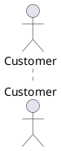

# TELEGRAM BOT

Specification document for the Bot.

## STAKEHOLDERS

- Patients
- Nurses
- Dashboard
- System Administrator

## ACTORS

- Dashboard (provides information to return to the user on request)
- Nurses (the only people authorized)
- System Administrator

## INTERFACE (!)

## FUNCT REQS

| N. req  | Description |
| ------- | ----------- |
| 1       | Interact with the Dashboard |
| 1.1     | Extract information from the Dashboard |
| 2       | Manage alerts |
| 2.1     | Receive alerts |
| 2.2     | Send warning messages to the medical staff |
| 3       | Manage patients |
| 3.1     | Register patients |
| 3.2     | Remove patients |
| 3.3     | Edit patients |
| 4       | Manage rooms |
| 4.1     | Set desired Room Temperature |
| 4.2     | Set desired Room Lighting |
| 4.3     | Monitor Room Temperature |
| 4.4     | Monitor Room Lighting |

## NON-FUNC REQS

| Type of req | Description |
| ----------- | ----------- |
| Usability   | Command names must be clear wrt their purpose |
| Usability   | Staff should be able to understand the commands and their usage in 5 minutes |
| Performance | Alerts should be forwarded to the user in < 5 sec |
| Performance | Data from dashboard should be displayed in < 5 sec |
| Extendability | The bot may include further features and should be able to integrate them easily without changing the overall structure of the bot |
| Availability | The bot should be available 99% of the time |
| Scalability | Every metric of the bot should not depend on the n. users involved |
| Security    | Authenticate User (Nurse, System Admin) |

## USE CASE SCENARIO

### Scenario 1: Authenticate User

| Field | Description |
| ------| ----------- |
| Actor | Nurse |
| Pre-condition | User is not authenticated |
| Post-condition | User is authenticated |
| Steps | User is asked to insert its ID and password |
| | The system checks whether the user exists and the password is correct |
| | The system informs the user that he/she has been authenticated |

### Scenario 2: User looks for info about a patient

| Field | Description |
| ------| ----------- |
| Actor | Nurse, System Administrator |
| Pre-condition | User looks for a specific information about a patient |
|               | User is authenticated |
| Post-condition | User retrieves the information |
| Steps | User launches a command for searching information about patients |
|       | User prompts the Patient ID and the kind of information required |
|       | The system checks whether the Patient exists and that kind of information is available |
|       | The system returns the desired information |

### Scenario 3: System Administrator registers a patient

| Field | Description |
| ------| ----------- |
| Actor | System Administrator |
| Pre-condition | A patient of the clinic is not present in the catalog |
|               | User is authenticated |
| Post-condition | The patient is successfully inserted into the catalog |
| Steps | The User launches a command for inserting new patients |
|       | The User inputs the Patient Data and all kind of information that are available at registration time (Patient ID can be defined manually or not)|
|       | The system verifies that the Patient Data are not already present (i.e. there is no other Patient with exactly the same data) |
|       | The system registers the patient and returns a success message to the User |

### Scenario 3.1: Nurse registers a patient

| Field | Description |
| ------| ----------- |
| Actor | Nurse |
| Pre-condition | A patient of the clinic is not present in the catalog |
|               | User is authenticated |
| Post-condition | The patient is successfully inserted into the catalog |
| Steps | The User launches a command for inserting new patients |
|       | The User inputs the Patient Data and all kind of information that are available at registration time (Patient ID can be defined manually or not)|
|       | The system verifies that the Patient Data are not already present (i.e. there is no other Patient with exactly the same data) |
|       | The system forwards the request to a System Administrator, who is the only role authorized to perform this kind of operation |
|       | System Administrator registers a patient: See Scenario 3.2 |

### Scenario 3.2: System Administrator handles a Patient Registration Request

| Field | Description |
| ------| ----------- |
| Actor | System Administrator |
| Pre-condition | A patient of the clinic is not present in the catalog |
|               | User is authenticated |
|               | A Registration Request has been forwarded to the User |
| Post-condition | The patient is successfully inserted into the catalog |
| Steps | The User reads a notification of a Registration Request |
|       | The User can read and analyze the Request and all data submitted |
|       | The User decides whether to accept the Request |
|       | The system follows the User decision and returns an acknowledge message |

### Scenario 4: System Administrator removes a patient

| Field | Description |
| ------| ----------- |
| Actor | System Administrator |
| Pre-condition | A patient of the clinic must be removed and is present in the catalog |
|               | User is authenticated |
| Post-condition | The patient is no longer present in the catalog |
| Steps | The User launches a command for removing a patient |
|       | The User inputs either the Patient ID or their name |
|       | If the Patient ID is input: |
|       | - The system verifies that the Patient ID exists |
|       | - The system removes the patient |
|       | - The system returns a success message to the User |
|       | If the Patient Name is input: |
|       | - The system looks for all Patients with that name |
|       | - The system shows to the user all Patients with that name and their data and asks to choose which one to remove|
|       | - The user chooses the user to remove |
|       | - The system returns a success message to the User |

### Scenario 4.1: Nurse removes a patient

| Field | Description |
| ------| ----------- |
| Actor | Nurse |
| Pre-condition |  A patient of the clinic must be removed and is present in the catalog |
|               | Input from the User is valid (Patient ID/Name exists) |
|               | User is authenticated |
| Post-condition | The patient is no longer present in the catalog |
| Steps | The User launches a command for removing a patient |
|       | The User inputs either the Patient ID or their name |
|       | If the Patient ID is input: |
|       | - The system verifies that the Patient ID exists |
|       | - The system forwards the request to a System Administrator |
|       | - The system informs that a System Administrator will handle the request |
|       | - The System Administrator handles the request: see Scenario 4.2 |
|       | If the Patient Name is input: |
|       | - The system looks for all Patients with that name |
|       | - The system shows to the user all Patients with that name and their data and asks to choose which one to remove|
|       | - The user chooses the user to remove |
|       | - The system informs that a System Administrator will handle the request |
|       | - The System Administrator handles the request: see Scenario 4.2 |

### Scenario 4.2: System Administrator handles a Patient Removal Request

| Field | Description |
| ------| ----------- |
| Actor | System Administrator |
| Pre-condition | A patient of the clinic is present in the catalog and must be removed|
|               | User is authenticated |
|               | A Removal Request has been forwarded to the User |
| Post-condition | The patient is successfully inserted into the catalog |
| Steps | The User reads a notification of a Removal Request |
|       | The User can read and analyze the Request and all data submitted |
|       | The User decides whether to accept the Request |
|       | The system follows the User decision and returns an acknowledge message |

### Scenario 5: System Administrator edits a patient

| Field | Description |
| ------| ----------- |
| Actor | System Administrator|
| Pre-condition | A patient of the clinic is present in the catalog and must be edited |
|               | Input from the User is valid |
|               | User is authenticated |
| Post-condition | Patient Data is successfully edited |
| Steps | The User launches a command for editing patients |
|       | The User inputs either the Patient ID or their name |
|       | If the Patient ID is input: |
|       | - The system verifies that the Patient ID exists |
|       | - The system asks which field(s) should be edited for the patient |
|       | - The User edits them |
|       | - The system updates its information |
|       | - The system returns a success message to the User |
|       | If the Patient Name is input: |
|       | - The system looks for all Patients with that name |
|       | - The system shows to the user all Patients with that name and their data and asks to choose which one to edit |
|       | - The system asks which field(s) should be edited for the patient |
|       | - The User edits them |
|       | - The system updates its information |
|       | - The system returns a success message to the User |

### Scenario 5.1: Nurse edits a patient

| Field | Description |
| ------| ----------- |
| Actor | Nurse |
| Pre-condition | A patient of the clinic is present in the catalog and must be edited |
|               | Input from the User is valid |
|               | User is authenticated |
| Post-condition | Patient Data is successfully edited |
| Steps | The User launches a command for editing a patient |
|       | The User inputs either the Patient ID or their name |
|       | If the Patient ID is input: |
|       | - The system verifies that the Patient ID exists |
|       | - The system asks which field(s) should be edited for the patient |
|       | - The User edits them |
|       | - The system forwards the request to a System Administrator |
|       | - The system informs that a System Administrator will handle the request |
|       | - The System Administrator handles the request: see Scenario 5.2 |
|       | If the Patient Name is input: |
|       | - The system looks for all Patients with that name |
|       | - The system shows to the user all Patients with that name and their data and asks to choose which one to edit|
|       | - The user chooses the user to edit |
|       | - The system asks which field(s) should be edited for the patient |
|       | - The User edits them |
|       | - The system informs that a System Administrator will handle the request |
|       | - The System Administrator handles the request: see Scenario 5.2 |

### Scenario 5.2: System Administrator handles a Patient Edit Request

| Field | Description |
| ------| ----------- |
| Actor | System Administrator |
| Pre-condition | A patient of the clinic is present in the catalog and must be edited|
|               | User is authenticated |
|               | An Edit Request has been forwarded to the User |
| Post-condition | Patient Data is successfully edited |
| Steps | The User reads a notification of an Edit Request |
|       | The User can read and analyze the Request and all data submitted |
|       | The User decides whether to accept the Request |
|       | The system follows the User decision and returns an acknowledge message |

### Scenario 6: Warning the staff that there is a medical emergency

| Field | Description |
| ------| ----------- |
| Actor | Nurses |
| Pre-condition | A patient in the clinic has a medical emergency |
|               | The patient is already present in the catalog |
|               | Users are authenticated and always logged in |
| Post-condition | Users are informed of the emergency and can handle it |
| Steps | The system receives a warning from monitoring modules |
|       | The system reads the list of all Users that are currently working in the clinic |
|       | The system forwards the warning to those Users |

### Scenario 7: User sets desired Room Temperature/Lighting

| Field | Description |
| ------| ----------- |
| Actor | Nurses |
| Pre-condition | The Room exists and is registered |
|               | User is authenticated |
| Post-condition | Room Temperature/Lighting is set |
| Steps | The User launches a command to set the Room parameters |
|       | The User selects the Room to set |
|       | The system verifies whether the Room is registered |
|       | The User selects the parameter to modify |
|       | The User sets the new value for the parameter |
|       | The system forwards the request to the Room Temperature/Lighting manager |

### Scenario 8: User monitors Room Temperature/Lighting

| Field | Description |
| ------| ----------- |
| Actor | Nurses |
| Pre-condition | The Room exists and is registered |
|               | User is authenticated |
| Post-condition | Room Temperature/Lighting value can be read |
| Steps | The User launches a command to read the current Room parameters |
|       | The User selects the Room to set |
|       | The system verifies whether the Room is registered |
|       | The User selects the parameter to read |
|       | The system forwards the request to the Room Temperature/Lighting manager, asking for the searched value |
|       | The User reads the value for the parameter |

### Scenario 9: System Administrator registers a new Room

| Field | Description |
| ------| ----------- |
| Actor | System Administrator |
| Pre-condition | The Room exists but is not present in the catalog yet |
|               | User is authenticated |
| Post-condition | The Room is registered correctly in the catalog |
| Steps | The User launches a command to register a new Room |
|       | The User defines the ID of the new Room (manually or automatically)|
|       | The system verifies whether a Room with the same ID already exists (in case of manual definition of the Room ID) |
|       | The system forwards the request to the Room and Patient catalog, which proceeds to fulfill it |

### Scenario E.1: User is not authenticated successfully

| Field | Description |
| ------| ----------- |
| Actor | Nurses, System Administrator |
| Pre-condition | The User is not logged in and s/he is not authenticated |
| Post-condition | The User is logged in |
| Steps | The system asks for User ID and Password |
|       | The User inserts them |
|       | The system looks for the User and his/her password |
|       | If credentials are correct: |
|       | - The User is logged in case of success with a success message |
|       | Otherwise: |
|       | - the procedure is repeated until the User can log in |

### Scenario E.2.1: User looks for a patient/room, but they are not defined correctly by the User

| Field | Description |
| ------| ----------- |
| Actor | Nurses, System Administrator |
| Pre-condition | The User looks for a patient/room that exists |
|               | The patient/room is not correctly inserted by the User|
|               | The User has already tried to look for the patient/room |
|               | The System has already looked for the Patient/Room |
| Post-condition | The User finds the Room/Patient |
| Steps | The System returns an Error message |
|       | The System asks the User to retry or go back |
|       | In case of Retry: |
|       | - Repeat the Triggering Scenario until the search is performed again
|       | - In case of success: |
|       | --  return a success message to the User |
|       | - Otherwise: |
|       | --  repeat Scenario E.2.1 |
|       | Otherwise: |
|       | - Cancel the operation |

### Scenario E.2.2: User looks for a patient/room, but it does not exist

| Field | Description |
| ------| ----------- |
| Actor | Nurses, System Administrator |
| Pre-condition | The User looks for a patient/room that does not exist |
|               | The User has already tried to look for the patient/room |
|               | The System has already verified that the patient/room is not present |
| Post-condition | The User is not able to find the Patient/Room|
| Steps | The System returns an Error message |
|       | The System asks the User to retry or go back |
|       | In case of Retry: |
|       | - Repeat the Triggering Scenario until the search is performed again
|       | - In case of success: |
|       | --  return a success message to the User |
|       | - Otherwise: |
|       | --  repeat Scenario E.2.2 |
|       | Otherwise: |
|       | - Cancel the operation |

### Scenario E.3: User tries to register a duplicate patient

| Field | Description |
| ------| ----------- |
| Actor | Nurses, System Administrator |
| Pre-condition | The User tries to register a patient that is already present in the catalog |
|               | The System has already checked that the patient is already present |
| Post-condition | The User is not able to register the patient |
| Steps | The System returns an Error Message |
|       | The System asks to Retry or go back |
|       | In case of Retry: |
|       | - Repeat the Triggering Scenario until the search is performed again
|       | - In case of success: |
|       | --  return a success message to the User |
|       | - Otherwise: |
|       | --  repeat Scenario E.3 |
|       | Otherwise: |
|       | - Cancel the operation |

### Scenario E.4: User tries to register a patient with invalid input

| Field | Description |
| ------| ----------- |
| Actor | Nurses, System Administrator |
| Pre-condition | The User tries to register a patient |
|               | Input from the User is invalid |
|               | The System has just received input from the User and checked whether it is valid |
| Post-condition | The User is not able to register the patient |
| Steps | The System returns an Error Message |
|       | The System asks to Retry or go back |
|       | In case of Retry: |
|       | - Repeat the Triggering Scenario until the search is performed again
|       | - In case of success: |
|       | --  return a success message to the User |
|       | - Otherwise: |
|       | --  repeat Scenario E.4 |
|       | Otherwise: |
|       | - Cancel the operation |

### Scenario E.5.1: User tries to remove a patient that does not exist

| Field | Description |
| ------| ----------- |
| Actor | Nurses, System Administrator |
| Pre-condition | The User wants to remove a patient |
|               | The Patient is not present in the Catalog |
|               | The System has already verified that the Patient does not exist |
| Post-condition | The User is not able to remove the Patient |
| Steps | The System returns an Error Message |
|       | The System asks to Retry or go back |
|       | In case of Retry: |
|       | - Repeat the Triggering Scenario until the search is performed again
|       | - In case of success: |
|       | --  return a success message to the User |
|       | - Otherwise: |
|       | --  repeat Scenario E.5.1 |
|       | Otherwise: |
|       | - Cancel the operation |

### Scenario E.5.2: User tries to remove a patient, but they are not correctly defined by the User

| Field | Description |
| ------| ----------- |
| Actor | Nurses, System Administrator |
| Pre-condition | The User wants to remove a patient |
|               | The Patient is present in the Catalog |
|               | The System has already verified that the Patient does not exist (ill-defined) |
| Post-condition | The User is able to remove the Patient |
| Steps | The System returns an Error Message |
|       | The System asks to Retry or go back |
|       | In case of Retry: |
|       | - Repeat the Triggering Scenario until the search is performed again
|       | - In case of success: |
|       | --  return a success message to the User |
|       | - Otherwise: |
|       | --  repeat Scenario E.5.2 |
|       | Otherwise: |
|       | - Cancel the operation |

### Scenario E.6.1: User tries to edit a patient that does not exist

| Field | Description |
| ------| ----------- |
| Actor | Nurses, System Administrator |
| Pre-condition | The User tries to edit a patient |
|               | The Patient is not present in the Catalog |
|               | The System has already verified that the Patient does not exist (ill-defined) |
| Post-condition | The User is not able to edit the Patient |
| Steps | The System returns an Error Message |
|       | The System asks to Retry or go back |
|       | In case of Retry: |
|       | - Repeat the Triggering Scenario until the search is performed again
|       | - In case of success: |
|       | --  return a success message to the User |
|       | - Otherwise: |
|       | --  repeat Scenario E.6.1 |
|       | Otherwise: |
|       | - Cancel the operation |

### Scenario E.6.2: User tries to edit a patient, but they are not correctly defined by the User

| Field | Description |
| ------| ----------- |
| Actor | Nurses, System Administrator |
| Pre-condition | The User wants to edit a patient |
|               | The Patient is present in the Catalog |
|               | The System has already verified that the Patient does not exist (ill-defined) |
| Post-condition | The User is able to remove the Patient |
| Steps | The System returns an Error Message |
|       | The System asks to Retry or go back |
|       | In case of Retry: |
|       | - Repeat the Triggering Scenario until the search is performed again
|       | - In case of success: |
|       | --  return a success message to the User |
|       | - Otherwise: |
|       | --  repeat Scenario E.5.2 |
|       | Otherwise: |
|       | - Cancel the operation |

### Scenario E.7: The Bot tries to warn the staff, but the message is lost

| Field | Description |
| ------| ----------- |
| Actor | Nurses |
| Pre-condition | There is a medical emergency to report the medical staff |
|               | The message is lost |
| Post-condition | The medical emergency is correctly reported to the medical staff |
| Steps | Wait for 5 seconds |
|       | Try to report the emergency again |
|       | If no acknowledge: |
|       | - Retry |

### Scenario E.8: User tries to manage a Room that does not exist

| Field | Description |
| ------| ----------- |
| Actor | Nurses, System Administrator |
| Pre-condition | The User tries to manage a Room |
|               | The Room is not present in the Catalog |
|               | The System has already verified that the Room does not exist (ill-defined) |
| Post-condition | The User is not able to manage the Room |
| Steps | The System returns an Error Message |
|       | The System asks to Retry or go back |
|       | In case of Retry: |
|       | - Repeat the Triggering Scenario until the search is performed again
|       | - In case of success: |
|       | --  return a success message to the User |
|       | - Otherwise: |
|       | --  repeat Scenario E.8 |
|       | Otherwise: |
|       | - Cancel the operation |

### Scenario E.9: System Administrator tries to register a duplicate Room

| Field | Description |
| ------| ----------- |
| Actor | System Administrator |
| Pre-condition | The User tries to register a Room |
|               | The Room is already present in the Catalog |
|               | The System has already verified that the Room already exists (ill-defined) |
| Post-condition | The User is not able to register the Room |
| Steps | The System returns an Error Message |
|       | The System asks to Retry or go back |
|       | In case of Retry: |
|       | - Repeat the Triggering Scenario until the search is performed again
|       | - In case of success: |
|       | --  return a success message to the User |
|       | - Otherwise: |
|       | --  repeat Scenario E.9 |
|       | Otherwise: |
|       | - Cancel the operation |

## USE CASE DIAGRAM

## DEPLOYMENT DIAGRAM

- On Mobile Phones (users): Telegram
- On the Cloud: the Telegram Bot (it should be registered)

## SYSTEM DIAGRAM

- Cloud: Where the Bot resides
- Mobile phones and PCs: Where the Users can access the Bot
